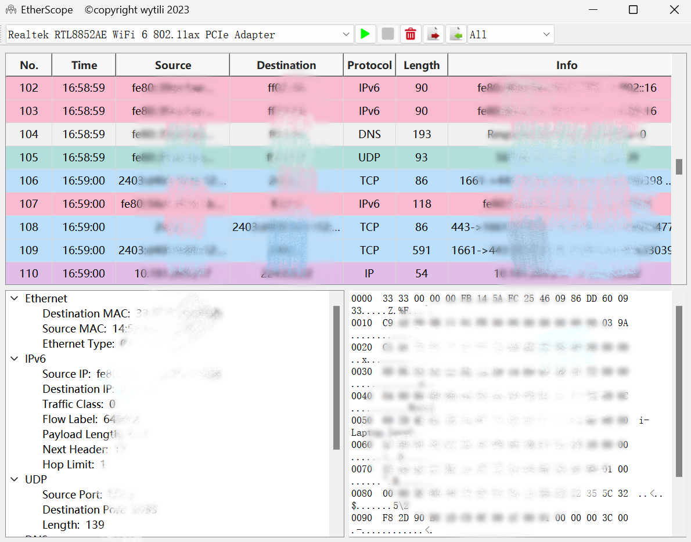

<p align="center">
  
</p>
<h1 align="center">EtherScope</h1>


> <p align="center">
>  A Network Sniffer built with PyQt5 and Scapy.
> </p>

<p align="center">
	
</p>

## QuickStart

Download the latest executable from the [Releases page](https://github.com/wytili/EtherScope/releases).

After downloading, double-click the executable file to start the application.

## Start from Source

1. **Install dependencies**

   ```sh
   pip install pyqt5 scapy
   ```

2. **Run**

   ```sh
   python main.py
   ```

## File Structure

```
EtherScope/
│
├── source/
│   ├── main.py              # entry point
│   ├── ui.py                # GUI
│   ├── packet.py            # capture and parse packets
│   ├── table.py             # show packets on the table 
│   └── assets/           	 # directory to store images
│── README.md
└── LICENSE.txt              
```

## TODO

- [x] capture and parse
- [x] import
- [x] export
- [x] restrictions between buttons
- [x] filter
- [ ] support for more protocols
- [ ] ......

